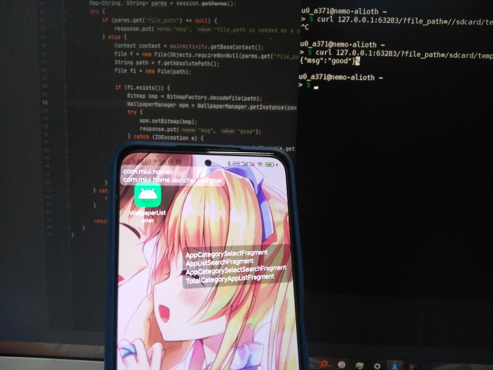

# Anzupop Wallpaper Listener

Target: API Level 24+ (7.0+)

Lock screen wallpaper won't change on a MIUI phone. This is NOT a bug.

## Usage

Press the button to start/stop.

InputView is for port input.


## API

### Endpoint

`GET` `<endpoint>/?file_path=<your file>&lock_screen=<null or 0 for system, others for lock screen>`

Change your wallpaper to file specified.

### Return

```json
{"msg":"file_path is needed as a query."}
```

```json
{"msg":"no such file"}
```

```json
{"msg":"Home screen set."}
```

```json
{"msg":"Lock screen set failed."}
```

```json
{"msg":"Lock screen set succeed."}
```

```json
<IOException stack>
```

## Example

Wallpaper filename is `206_spvfb204.jpg`



## Acknowledgements

[nanohttpd](https://github.com/NanoHttpd/nanohttpd) for minimal(?) functional HTTP server on Java platform

[Developer@Android](https://developer.android.com/)
