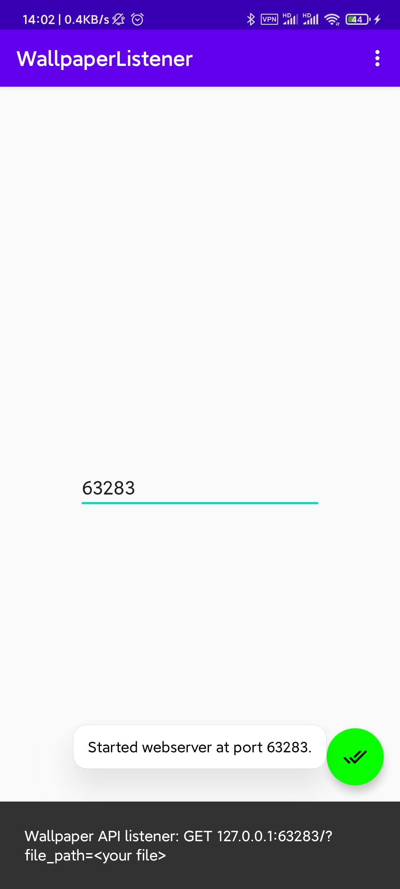

# Anzupop Wallpaper Listener

## Usage

Press the button to start/stop.

InputView is for port input.



## API

### Endpoint

`GET` `/?file_path=<your file>`

Change your wallpaper to file specified.

### Return

```json
{"msg":"file_path is needed as a query."}
```

```json
{"msg":"no such file"}
```

```json
{"msg":"good"}
```

```json
<IOException stack>
```